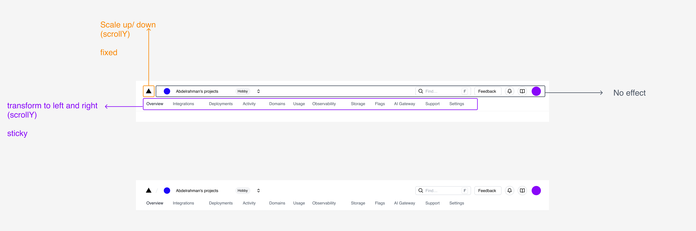

# Vercel Header Clone

A recreation of Vercel's dashboard header with smooth scroll animations built using Stimulus.js.

## Anatomy



## Technologies

- Stimulus.js - JavaScript framework
- Tailwind CSS - Styling
- Vite - Build tool
- Vanilla JavaScript - ES6+ syntax

## Project Structure

```
src/
├── controllers/
│   ├── header_controller.js    # Header scroll animations
│   └── navigation_controller.js # Navigation interactions
├── constants/
│   └── navigation.js           # Menu items configuration
├── utils/
│   └── interpolate.js          # Animation helper functions
└── assets/                     # SVG icons
```

## Run

```bash
pnpm install
pnpm dev
```

Open http://localhost:5173 to view the application.
